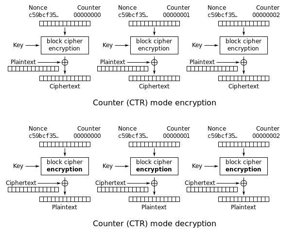
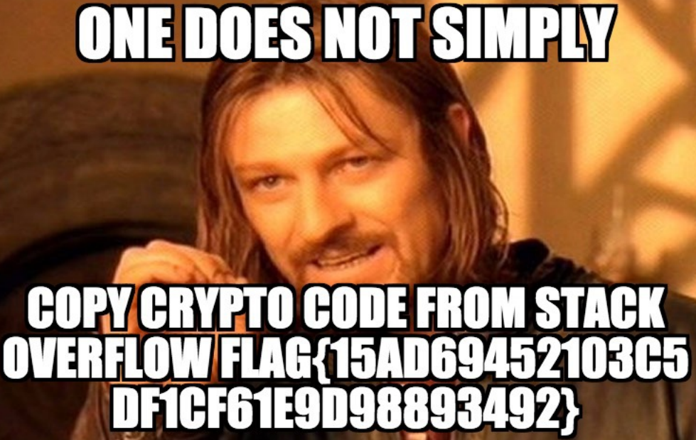

# 2017 SHA - [CRYPTO] Stack Overflow

## Key words

- AES-CTR
- Python Lambda as counter

## Solution

문제에 다음과 같은 파일을 제공해 줍니다.

```python
import os, sys
from Crypto.Cipher import AES

fn = sys.argv[1]
data = open(fn,'rb').read()

# Secure CTR mode encryption using random key and random IV, taken from
# http://stackoverflow.com/questions/3154998/pycrypto-problem-using-aesctr
secret = os.urandom(16)
crypto = AES.new(os.urandom(32), AES.MODE_CTR, counter=lambda: secret)

encrypted = crypto.encrypt(data)
open(fn+'.enc','wb').write(encrypted)
```

문제의 목적은 `flag.pdf.enc`를 복원하는 것 입니다.

먼저, CTR 모드의 암복호 과정은 다음과 같습니다.



IV와 Secret이 랜덤하지만 항상 고정적이기 때문에 결국엔 다음과 같이 복호화를 시도 해볼 수 있습니다

```
e(k, iv) ^ pt = ct
ct ^ e(k, iv) = pt
```

여기서 하려고 하는 것은 `e(k, iv)`값을 `ct`와 `xor`연산을 한 뒤, 결과가 `pt`처럼 잘 나오는지 보려고 합니다.

`e(k, iv)`값이 항상 고정적이기 때문에 이 값을 추측해봅니다.

블록 단위가 16바이트 이기 때문에 단순히 추측하기는 어렵고 대상이 `PDF`라는 점을 이용하여 첫 16바이트의 암호문을 이용하여 복호를 시도해봅니다.

먼저 `PDF` 구조를 보면 처음에 고정적인 바이트 값이 있습니다.

```
%  P  D  F  -  1  .
25 50 44 46 2D 31 2E

pt = "\x25\x50\x44\x46\x2d\x31\x2e\x00\x00\x00\x00\x00\x00\x00\x00\x00"
```

먼저 예측할 수 있는 부분은 제외한 나머지는 `\x00`으로 채웁니다.

그리고 암호화된 `flag.pdf.enc`의 첫 16바이트를 가져오면 다음과 같습니다.

```
D6 EA B9 75 30 19 6A 9B 05 2A EF 97 EE 2C 00 DB
```

여기서 우리는 `ct`와 `pt`를 구했기 때문에 이 두개를 `xor`하면 나오는 값은 `e(k, iv)`가 됩니다.

지금은 처음 7바이트만 했기 때문에 뒤의 9바이트는 정상적으로 복호화가 되지 않지만 `PDF`의 구조 특성을 이용하여 처음 7바이트를 복구 한뒤 그 이후의 바이트는 구조를 보면서 추측할 수 있습니다.

먼저 7바이트를 이용하여 `flag.pdf.enc`를 복구 하면 다음과 같습니다.

```
%PDF-1..........
j.<<./PRGoB..._B
R./Type..IPTQL..
.>>.end\B`;...O. <--
bj.<<./gYzT..p..
es./Kid@.Q....O0
 ]./Cou]T*.*..e.
ndobj.3..*^BZ*S^
./Type .pkVE:.?.
rent 2 ..X;.bE..
urces <.*%ioRJ..
```

4번째 줄에 보면 `end`로 끝나는 글자가 보이는데 이는 `endobj`로 예측할 수 있습니다. 이를 이용하여 다시 변환다음 다음과 같습니다.

```
%PDF-1.3 .......
j.<<./PageB..._B
R./Type /CPTQL..
.>>.endobj;...O.
bj.<<./TypT..p..
es./Kids [....O0
 ]./Count .*..e.
ndobj.3 0 ^BZ*S^
./Type /PaVE:.?.
rent 2 0 R;.bE..
```

이런식으로 계속 맞추다 보면 전체를 다 맞출 수 있고 정상적으로 `flag.pdf`를 얻을 수 있습니다.

## Solution Code

```python
def sxor(a, b):
    ret = ""
    for i in range(0, len(a)):
        ret += chr( ord(a[i]) ^ ord(b[i]))
    return ret

#            %  P   D   F   -   1   .   X   .
predict = "\x25\x50\x44\x46\x2d\x31\x2e\x00\x00\x00\x00\x00\x00\x00\x00\x00"

# p1  = 5c4260, obj = 6f626a : p1 xor obj = 33200a
predict = "\x25\x50\x44\x46\x2d\x31\x2e\x33\x20\x0a\x00\x00\x00\x00\x00\x00"

# p2 = 4200, obj = 7320
predict = "\x25\x50\x44\x46\x2d\x31\x2e\x33\x20\x0a\x31\x20\x00\x00\x00\x00"

# p3 = 5a2a, obj = 6a0a
predict = "\x25\x50\x44\x46\x2d\x31\x2e\x33\x20\x0a\x31\x20\x30\x20\x00\x00"

# p3 = 0e05, obj = 6167
predict = "\x25\x50\x44\x46\x2d\x31\x2e\x33\x20\x0a\x31\x20\x30\x20\x6f\x62"

enc     = "\xD6\xEA\xB9\x75\x30\x19\x6A\x9B\x05\x2A\xEF\x97\xEE\x2C\x00\xDB"
#print sxor("\x0e\x05", "\x61\x67").encode("hex")

key    = sxor(predict, enc)

data = open("flag.pdf.enc", "rb").read()
i = 0
res = ""
while i < len(data)-16:
    res += sxor(data[i*16:i*16+16], key)
    i += 1

fd = open("flag.pdf", "wb")
fd.write(res)
fd.close()
```

## Result


